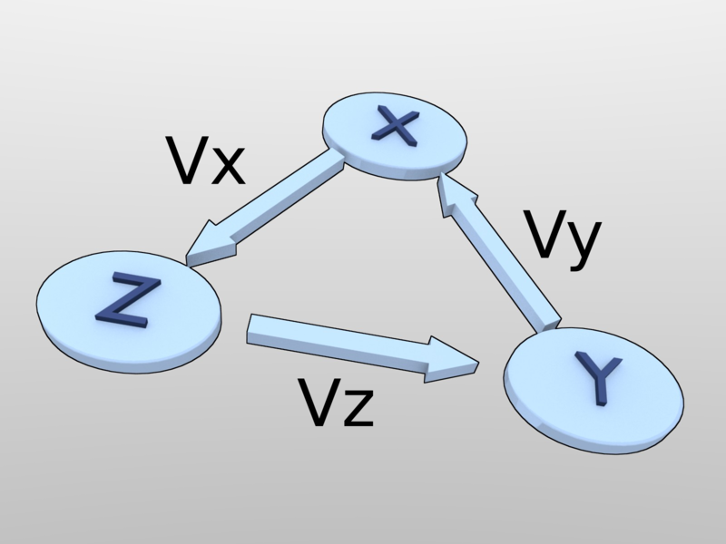
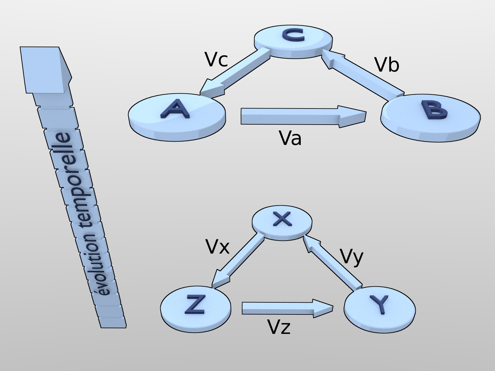

==============================
Problem of the three producers
==============================

The need to define a common currency being admitted within the
community of individuals, despite their fundamental disagreements
about their value judgements, there remain the fundamental problem of
defining this currency.  It is reduced to solving the spatiotemporal
problem of the three producers, as follow:

* X, Y and Z, produce respectively values Vx, Vy and Vz.  
* X wants to get Vy, Y wants to get Vz, and Z wants to get Vx.

We can see immediately, exchanges are not bilateral, but circular.  As
it is also quite possible that X do not value Vz, Y do not value Vx
and Z, Vy (principle of relativity), no good or service produced can
be used as common measure.  This is the fundamental point, which
implies that currency must be defined on a basis independent  from the
values produced by each.

The problem also exists in time, where individuals, productions,
services and goods evolve in nature, and will be gradually brought to
disappear or be replaced.  It is not less necessary to have, at any
time, the possibility to exchange appropriately productions of ones
and others, to meed their evolving respective needs.

   For a small unit of time "dt", the individuals X, Y and Z co-exist,
   producing and exchanging their stable values.

So, not only "in space" (for a short evolution time "dt"), the values
are not commonly recognized by producers and yet, can be exchanged
circularly, but also "in time", the individuals and the values
produced change dramatically.

It remains that for a sufficiently short time, we constat a certain
stability.  Therefore there is a continuous evolution of the economic
parameters, including the currency we want to define, which allows at
any time the present producers to agree on the stability of their tool
for circular exchanges, at least for this short time.

So as we will demonstrate in the following, and to be consistent with
our foundation, only a purely mathematical quantification of the
exchanges, independent of all reference good or service is acceptable
by the actors of the three producers problem.

This results doesn't diminish the value of the currency, as though
purely mathematical, its total quantity is limited at any time.  The
purchasing power it has will remain limited by the prices, beyond
which the producers could not exchange their products for lack of money.

   The problem of the three producers becomes more complex after a
   sufficient time, when they die and are replaced.

The problem is exposed, we will now scan possible solutions and the
difficulties they pose, before addressing the relativistic solution
itself.
